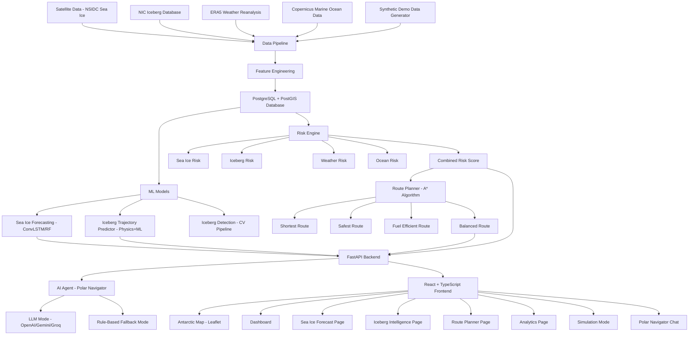

# POLAR-AI — Project Plan
## SIH26059: AI-Enabled Antarctic Sea-Ice, Iceberg Trajectory & Navigation Decision Support System

---

## System Architecture

---

## Technology Stack

### Backend
- **Language:** Python 3.11+
- **Framework:** FastAPI 0.104+
- **Database:** PostgreSQL 15 + PostGIS 3.3
- **ORM:** SQLAlchemy 2.0 + GeoAlchemy2
- **Migrations:** Alembic
- **ML:** scikit-learn, NumPy, SciPy, PyTorch (lightweight ConvLSTM)
- **GIS:** Shapely, pyproj, rasterio
- **Data:** pandas, xarray, netCDF4
- **Cache:** In-memory (functools.lru_cache) + optional Redis

### Frontend
- **Framework:** React 18 + TypeScript
- **Build:** Vite
- **Styling:** Tailwind CSS
- **Map:** Leaflet + react-leaflet
- **Charts:** Recharts
- **Icons:** Lucide React
- **State:** React Query (TanStack Query)
- **HTTP:** Axios

### Infrastructure
- **Containers:** Docker + Docker Compose
- **Services:** frontend, backend, postgres

---

## Phase Implementation Plan

### Phase 1 — Research & Documentation ✓
- [x] Investigate public Antarctic datasets
- [x] Create DATA_SOURCES.md
- [x] Create PROJECT_PLAN.md

### Phase 2 — Foundation
- [ ] Repository structure
- [ ] docker-compose.yml
- [ ] PostgreSQL/PostGIS setup
- [ ] FastAPI application skeleton
- [ ] Database models (SQLAlchemy)
- [ ] Alembic migrations
- [ ] React + Vite + Tailwind setup
- [ ] Environment variables

### Phase 3 — Data Pipeline
- [ ] download_sea_ice.py — NSIDC Sea Ice Index
- [ ] download_icebergs.py — NIC iceberg CSV
- [ ] download_weather.py — ERA5 via cdsapi
- [ ] download_ocean.py — CMEMS via copernicusmarine
- [ ] preprocess_sea_ice.py — GeoTIFF → grid arrays
- [ ] preprocess_icebergs.py — CSV → trajectory sequences
- [ ] preprocess_weather.py — NetCDF → grids
- [ ] preprocess_ocean.py — NetCDF → current fields
- [ ] create_features.py — ML feature engineering
- [ ] create_demo_data.py — Deterministic synthetic data
- [ ] run_pipeline.py — Orchestration

### Phase 4 — ML Models
- [ ] sea_ice_model.py — ConvLSTM / RandomForest baseline
- [ ] train_sea_ice.py — Training script
- [ ] predict_sea_ice.py — Inference service
- [ ] trajectory_model.py — Physics + ML hybrid
- [ ] iceberg_detection.py — CV-based detection pipeline

### Phase 5 — Risk Engine
- [ ] sea_ice_risk.py
- [ ] iceberg_risk.py
- [ ] weather_risk.py
- [ ] ocean_risk.py
- [ ] risk_engine.py — Combined weighted score

### Phase 6 — Route Planner
- [ ] geo_grid.py — Geographic grid construction
- [ ] astar.py — A* implementation
- [ ] cost_function.py — Multi-objective cost
- [ ] route_service.py — Route generation, comparison, replanning

### Phase 7 — Frontend
- [ ] AntarcticMap component (Leaflet)
- [ ] Dashboard page
- [ ] SeaIceForecast page
- [ ] IcebergIntelligence page
- [ ] RoutePlanner page
- [ ] Analytics page
- [ ] DataSources page
- [ ] Simulation mode
- [ ] PolarNavigator chat

### Phase 8 — AI Agent
- [ ] Agent tools (10 tools)
- [ ] LLM integration (OpenAI/Gemini/Groq)
- [ ] Rule-based fallback navigator

### Phase 9 — Testing
- [ ] Backend pytest suite
- [ ] API health tests
- [ ] ML model tests
- [ ] Risk engine tests
- [ ] Route generation tests
- [ ] Frontend build verification
- [ ] Docker end-to-end test

### Phase 10 — Demo Polish
- [ ] SIH 5-minute demo flow verification
- [ ] Performance optimization
- [ ] README completion
- [ ] MODEL_EVALUATION.md

---

## Key Design Decisions

1. **Demo-first architecture:** The system runs completely in `DATA_MODE=demo` without any external credentials. Real data adapters are separate modules that slot in when credentials are available.

2. **Lightweight ML:** Uses RandomForest baseline for sea-ice forecasting (fast to train, interpretable) with optional ConvLSTM. Physics-based trajectory prediction as baseline with ML overlay.

3. **Single-container development:** `docker compose up --build` starts everything. No manual database setup required.

4. **Rule-based AI fallback:** When no LLM API key is present, the Polar Navigator uses a deterministic rule engine that queries actual application data and generates structured responses.

5. **DEMO labels visible in UI:** Any response derived from synthetic data shows a `[DEMO DATA]` badge in the frontend.

---

## Scientific Disclaimer

> POLAR-AI is a research decision-support prototype developed for SIH26059. It is NOT certified for real-world vessel navigation. Predictions involve uncertainty and should not be used as the sole basis for navigation decisions. All forecasts are experimental.
