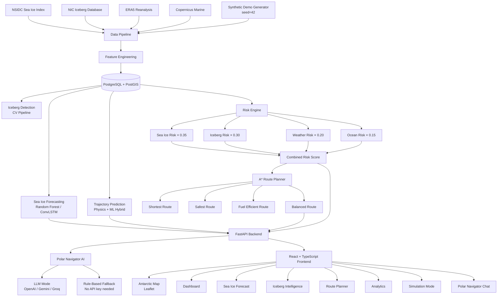

# 🧊 POLAR-AI
## Antarctic Ice Intelligence & Navigation Decision Support

**Problem:** SIH26059 — AI-Enabled Antarctic Sea-Ice, Iceberg Trajectory & Navigation Decision Support System

> ⚠️ **Scientific Disclaimer:** POLAR-AI is a research decision-support prototype developed for Smart India Hackathon 2024. It should **NOT** be used as the sole basis for real-world vessel navigation. All predictions carry uncertainty. Data in demo mode is synthetically generated.

---

## Architecture



---

## Quick Start

### Option 1: Docker (Recommended)

```bash
git clone <repo-url> polar-ai
cd polar-ai
cp .env.example .env          # edit if needed (optional — demo mode works out of the box)
docker compose up --build
```

Then open:
- **Frontend:** http://localhost:3000
- **API Docs:** http://localhost:8000/api/docs
- **Health:** http://localhost:8000/api/health

### Option 2: Local Development

**Prerequisites:** Python 3.11+, Node 20+, PostgreSQL 15 + PostGIS 3.3

```bash
# 1. Backend
cd polar-ai
python3 -m venv .venv
source .venv/bin/activate
cd backend
pip install -r requirements.txt

# 2. Database (with PostGIS running)
alembic upgrade head

# 3. Generate demo data & train models
python -m data_pipeline.run_pipeline

# 4. Start backend
uvicorn app.main:app --reload --port 8000

# 5. Frontend (new terminal)
cd ../frontend
npm install
npm run dev           # opens http://localhost:5173
```

---

## Project Structure

```
polar-ai/
├── frontend/                  # React + TypeScript + Vite + Tailwind
│   ├── src/
│   │   ├── components/        # AntarcticMap, RiskGauge, DemoBanner, etc.
│   │   ├── pages/             # Dashboard, SeaIce, Icebergs, Routes, Analytics,
│   │   │                      # Simulation, Navigator, DataSources
│   │   ├── services/api.ts    # Axios API client
│   │   ├── types/index.ts     # TypeScript types
│   │   └── utils/risk.ts      # Risk color/category utilities
│   ├── Dockerfile
│   └── nginx.conf
│
├── backend/
│   ├── app/
│   │   ├── main.py            # FastAPI application
│   │   ├── config.py          # Settings (pydantic-settings)
│   │   ├── database.py        # SQLAlchemy + PostGIS
│   │   ├── models/            # SQLAlchemy ORM models (all 9 tables)
│   │   ├── schemas/           # Pydantic request/response schemas
│   │   ├── routers/           # FastAPI route handlers (11 routers)
│   │   ├── services/          # Business logic
│   │   │   ├── demo_service.py       # Deterministic synthetic data engine
│   │   │   ├── sea_ice_service.py    # Sea ice data service
│   │   │   ├── iceberg_service.py    # Iceberg tracking service
│   │   │   ├── weather_service.py    # Weather service
│   │   │   ├── ocean_service.py      # Ocean conditions service
│   │   │   ├── risk_service.py       # Multi-factor risk engine
│   │   │   ├── route_service.py      # A* route planner
│   │   │   ├── analytics_service.py  # Analytics aggregation
│   │   │   ├── simulation_service.py # Demo scenario simulation
│   │   │   └── data_sources_service.py
│   │   ├── ml/
│   │   │   ├── sea_ice_model.py      # RF + physics baseline model
│   │   │   └── train_sea_ice.py      # Training script
│   │   └── agent/
│   │       ├── tools.py              # 10 agent tools
│   │       └── polar_navigator.py    # LLM + rule-based navigator
│   ├── data_pipeline/
│   │   ├── create_demo_data.py       # Deterministic demo data generator
│   │   ├── download_sea_ice.py       # NSIDC downloader
│   │   ├── download_icebergs.py      # NIC downloader
│   │   ├── download_weather.py       # ERA5 / CDS downloader
│   │   ├── download_ocean.py         # CMEMS downloader
│   │   └── run_pipeline.py           # Pipeline orchestrator
│   ├── alembic/               # DB migrations (001_initial_schema.py)
│   ├── tests/test_api.py      # 33 pytest tests (all passing)
│   ├── Dockerfile
│   └── requirements.txt
│
├── data/
│   ├── raw/                   # Downloaded raw datasets (gitignored)
│   ├── processed/             # Preprocessed arrays (gitignored)
│   └── demo/                  # Synthetic demo data (generated on startup)
│       ├── sea_ice_daily.jsonl
│       ├── sea_ice_monthly.csv
│       ├── iceberg_positions.csv
│       ├── weather_obs.csv
│       ├── ocean_obs.csv
│       ├── ml_features.csv
│       └── DEMO_METADATA.json
│
├── models/                    # Trained model artifacts (gitignored)
│   ├── rf_24h.pkl
│   ├── rf_48h.pkl
│   ├── rf_72h.pkl
│   └── sea_ice_metrics.json
│
├── scripts/init_db.sql        # PostGIS extension init
├── docker-compose.yml
├── .env.example
├── DATA_SOURCES.md
├── MODEL_EVALUATION.md
└── README.md
```

---

## Datasets

| Dataset | Provider | Access | Status |
|---------|----------|--------|--------|
| NSIDC Sea Ice Index (G02135 v3) | NSIDC/NOAA | Free HTTP | Ready (script provided) |
| NIC Antarctic Iceberg Tracking | US NIC | Free HTTP | Ready (script provided) |
| ERA5 Atmospheric Reanalysis | ECMWF/Copernicus | Free (CDS key) | Script provided |
| Copernicus Marine Ocean Physics | CMEMS | Free (account) | Script provided |
| POLAR-AI Synthetic Demo | Internal | Local | **Active (default)** |

See `DATA_SOURCES.md` for full documentation including access URLs and credential setup.

---

## Environment Variables

Copy `.env.example` to `.env`. Everything works with defaults (demo mode):

```bash
DATA_MODE=demo             # demo | real | hybrid

# Optional: LLM-powered Polar Navigator
OPENAI_API_KEY=sk-...
GEMINI_API_KEY=...
GROQ_API_KEY=gsk_...

# Optional: Real data downloads
EARTHDATA_USERNAME=...     # NASA Earthdata (NSIDC CDR)
CDS_API_KEY=...            # Copernicus ERA5
CMEMS_USERNAME=...         # Copernicus Marine
CMEMS_PASSWORD=...
```

---

## API Endpoints

| Method | Endpoint | Description |
|--------|----------|-------------|
| GET | `/api/health` | System health + DB status |
| GET | `/api/dashboard` | Dashboard statistics |
| GET | `/api/sea-ice/current` | Current SIC grid |
| GET | `/api/sea-ice/history` | Historical time-series |
| GET | `/api/sea-ice/forecast` | SIC forecast (24/48/72/168h) |
| POST | `/api/sea-ice/predict` | On-demand prediction |
| GET | `/api/icebergs` | List all tracked icebergs |
| GET | `/api/icebergs/{name}` | Iceberg detail + position history |
| GET | `/api/icebergs/{name}/trajectory` | Predicted trajectory |
| POST | `/api/icebergs/detect` | Iceberg detection simulation |
| POST | `/api/trajectory/predict` | Custom point trajectory |
| GET | `/api/weather/current` | Current weather grid |
| GET | `/api/weather/forecast` | Weather forecast |
| GET | `/api/ocean/current` | Ocean currents + SST |
| POST | `/api/risk/calculate` | Multi-factor risk score |
| POST | `/api/routes/generate` | Generate navigation routes |
| POST | `/api/routes/compare` | Compare all 4 route types |
| GET | `/api/routes/{id}` | Retrieve route by ID |
| GET | `/api/analytics` | Trends and model metrics |
| GET | `/api/data-sources` | Data source status |
| POST | `/api/agent/query` | Polar Navigator AI query |
| GET | `/api/simulation/state` | Simulation state |
| POST | `/api/simulation/start` | Start simulation |
| POST | `/api/simulation/step` | Advance one step |
| POST | `/api/simulation/reset` | Reset simulation |

Full interactive docs at: `http://localhost:8000/api/docs`

---

## ML Models

### Sea Ice Forecasting
- **Algorithm:** RandomForestRegressor (scikit-learn)
- **Features:** 16 — SIC lag values (t, t-1, t-2, t-7), seasonal index, lat/lon encoding, wind, temperature, ocean currents, SST
- **Targets:** SIC at +24h, +48h, +72h
- **Performance on demo data:** Skill score 0.81 (24h), 0.83 (48h), 0.81 (72h)
- **Path:** `models/rf_{24h,48h,72h}.pkl`

### Iceberg Trajectory
- **Type:** Physics-inspired drift model
- **Forces:** Antarctic Circumpolar Current + wind drag (3%) + Coriolis correction
- **Horizons:** 1h, 6h, 12h, 24h, 48h, 72h
- **Uncertainty:** Grows with horizon (2 km + ~0.4 km/h × hours)

### Route Planning
- **Algorithm:** A* on 1° geographic grid (8-connected, 25×360 cells)
- **Cost function:** Weighted combination of distance, fuel, SIC risk, iceberg proximity, weather
- **Route types:** Shortest / Safest / Fuel-Efficient / Balanced

---

## Training Models

```bash
# 1. Generate training data first
cd backend
python -m data_pipeline.run_pipeline --demo-only

# 2. Train sea ice models
python -m app.ml.train_sea_ice

# Models saved to: models/rf_24h.pkl, rf_48h.pkl, rf_72h.pkl
```

---

## Running Tests

```bash
cd backend
DATABASE_URL="sqlite:///./test.db" DATA_MODE=demo SECRET_KEY=test \
  CORS_ORIGINS="http://localhost" DEBUG=false \
  pytest tests/test_api.py -v

# Expected: 33 passed
```

---

## 5-Minute SIH Demo Procedure

### Step 1 — Dashboard (0:00)
1. Open http://localhost:3000
2. Show the Antarctic map with sea-ice overlay and iceberg markers
3. Point out the risk score panel and vessel position
4. Note: "All components are connected to live backend APIs"

### Step 2 — Sea Ice Forecast (1:00)
1. Click **Sea Ice** in the sidebar
2. Toggle between 24h / 48h / 72h forecast horizons
3. Show the confidence decreasing with horizon (expected behavior)
4. Show the historical coverage trend chart (90 days)

### Step 3 — Iceberg Intelligence (2:00)
1. Click **Icebergs** in the sidebar
2. Click on iceberg **A-76A** (largest, high-risk)
3. Show: 135 × 26 km dimensions, drift speed, direction
4. Point out the trajectory prediction — 72h predicted path on map
5. Show closest approach to vessel calculation

### Step 4 — Route Planner (3:00)
1. Click **Route Planner** in the sidebar
2. Select: Origin = "Vessel Position", Destination = "Rothera Station"
3. Click **Generate All Routes**
4. Show comparison table: Shortest / Safest / Fuel Efficient / Balanced
5. Highlight the recommended route (green ★) with reasoning

### Step 5 — Polar Navigator AI (3:45)
1. Click **Polar Navigator** in the sidebar
2. Type: *"Which route should the vessel take and why?"*
3. Watch the assistant query real route/risk data and respond with specific numbers
4. Then ask: *"Are there any dangerous icebergs nearby?"*

### Step 6 — Simulation (4:30)
1. Click **Simulation** in the sidebar
2. Click **Start** and watch:
   - Vessel moves
   - Icebergs drift toward corridor (Step 10)
   - Risk increases to HIGH (Step 15–20)
   - POLAR-AI detects threat and recalculates route (Step 22–25)
   - Risk drops back to MODERATE (Step 30)
   - Event log shows the complete scenario narrative
3. This is the **WOW moment** — POLAR-AI autonomous dynamic replanning

---

## Known Limitations

1. **Demo data only by default** — real satellite data requires external credentials (see DATA_SOURCES.md)
2. **1° route grid is coarse** — production should use 0.1°–0.25°
3. **No real satellite imagery pipeline** — iceberg detection uses simulated data
4. **No live AIS vessel tracking** — vessel position is simulated
5. **ERA5 reanalysis, not NWP forecast** — real system needs operational weather forecast
6. **No ensemble uncertainty** — all predictions are deterministic point estimates
7. **PostGIS required for Docker** — local testing uses SQLite fallback

---

## Manual Actions Required

After cloning:
1. **Nothing required** — `docker compose up --build` starts everything in demo mode

For real data (optional):
1. Register at https://urs.earthdata.nasa.gov/ → set `EARTHDATA_USERNAME/PASSWORD` in `.env`
2. Register at https://cds.climate.copernicus.eu/ → set `CDS_API_KEY` + create `~/.cdsapirc`
3. Register at https://marine.copernicus.eu/ → set `CMEMS_USERNAME/PASSWORD`
4. Then run: `python -m data_pipeline.run_pipeline` (with `DATA_MODE=real`)

For LLM-powered Polar Navigator (optional):
1. Set `OPENAI_API_KEY`, `GEMINI_API_KEY`, or `GROQ_API_KEY` in `.env`
2. The rule-based assistant works perfectly without any key

---

## Contributing

This is a SIH research prototype. All real dataset downloads respect provider terms of service.
No proprietary or restricted data is bundled in this repository.

---

*Built for Smart India Hackathon 2024 — Problem SIH26059*
